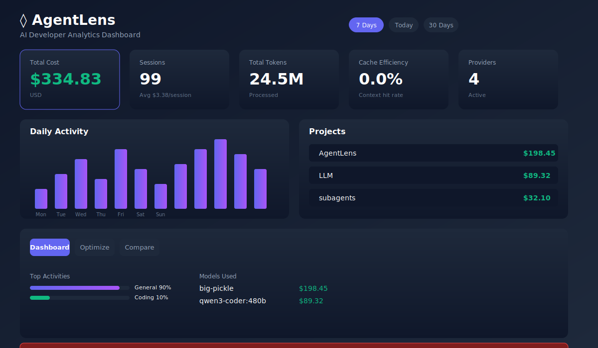
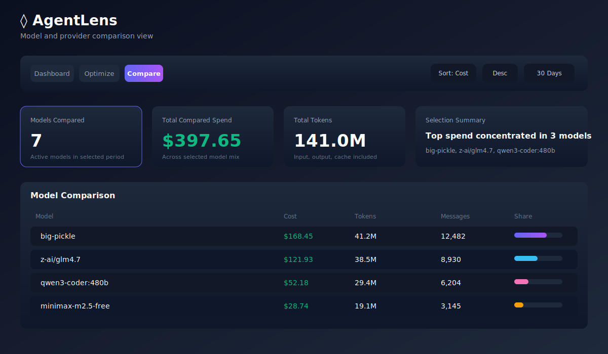
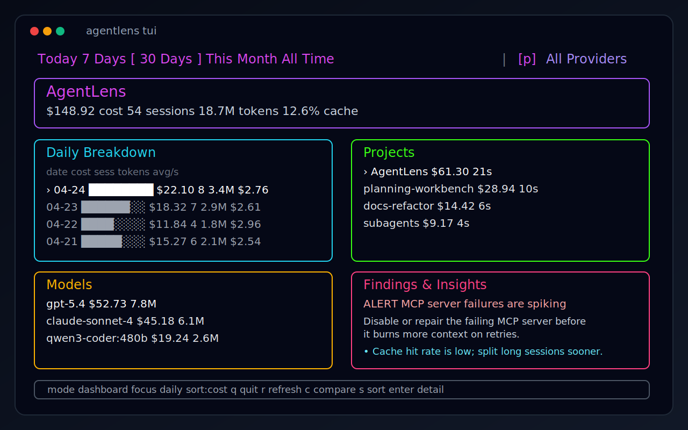

# AgentLens

**Local-first AI developer analytics for Claude Code, Cursor, Codex, OpenCode, Pi, and GitHub Copilot.**

AgentLens parses your local AI coding session history, computes cost and token usage, surfaces retry loops and waste patterns, and now adds incremental processing, active optimization alerts, tool/MCP intelligence, and actionable advice across CLI, TUI, web, and VS Code.

[](https://github.com/rajaraghvendra/AgentLens)
[](https://www.npmjs.com/~rajaraghvendra)

## What It Does

- **Cross-provider analytics** for Claude Code, Cursor, Codex, OpenCode, Pi, and GitHub Copilot.
- **Exact token accounting** for input, output, cache read, and cache write where provider data supports it.
- **Cost tracking** with pricing lookup, currency conversion, and provider/model breakdowns.
- **Incremental session processing** with local cache/index reuse so unchanged session files are not reparsed every time.
- **Deterministic activity classification** across coding, debugging, git ops, testing, planning, delegation, and more.
- **One-shot and retry-loop detection** to show where agents got it right first time and where they burned tokens.
- **Optimizer findings and active alerts** for waste patterns such as edit loops, excessive reads, cache inefficiency, MCP failures, tool loops, and high-cost low-yield sessions.
- **Tool and MCP intelligence** with rankings for instability, repeated loops, waste contribution, and command-pattern inefficiency.
- **Actionable advice and digests** such as model right-sizing, session reset guidance, MCP stabilization advice, and savings opportunities.
- **Multiple interfaces**:
  - `agentlens report`, `status`, `compare`, `optimize`
  - `agentlens advise`, `anomalies`, `tools`, `digest`
  - `agentlens cache status`, `agentlens cache rebuild`
  - `agentlens tui`
  - `agentlens dashboard`
  - VS Code extension with status-bar cost visibility
- **Local-first execution**. Core parsing runs against local provider data on your machine.

## New in 0.1.12

- Incremental parsing cache with processing stats
- Active optimization alerts in dashboard, CLI, TUI, and VS Code status flow
- Tool, MCP, and command-pattern efficiency analysis
- Daily and weekly advice digests
- New CLI commands for advice, anomalies, tools, and cache management

## Screenshots

### Web Dashboard



### Compare View



### Terminal UI



## Installation

### Global Install
```bash
npm install -g @rajaraghvendra/agentlens
```

This installs the `agentlens` CLI and the packaged dashboard runtime.

If `agentlens` is not found after global install, your npm global bin directory is not on `PATH`.

Check your npm global prefix:
```bash
npm prefix -g
```

If it prints `~/.npm-global`, add this to your shell profile:
```bash
export PATH="$HOME/.npm-global/bin:$PATH"
```

For `zsh` on macOS:
```bash
echo 'export PATH="$HOME/.npm-global/bin:$PATH"' >> ~/.zshrc
source ~/.zshrc
```

Then verify:
```bash
which agentlens
agentlens --help
```

### Run Without Installing
```bash
npx @rajaraghvendra/agentlens <command>
```

### From Source
```bash
git clone https://github.com/rajaraghvendra/AgentLens.git
cd AgentLens
npm install
npm run build
```

## Quick Start

```bash
agentlens report                 # Detailed usage report (last 7 days)
agentlens report -p today        # Today only
agentlens report --provider codex
agentlens status                 # Quick budget/cost snapshot
agentlens optimize               # Optimization findings
agentlens compare                # Model comparison
agentlens advise                 # Active issues + recommendations
agentlens anomalies              # Current optimization alerts
agentlens tools                  # Tool/MCP efficiency rankings
agentlens digest --daily         # Daily optimization digest
agentlens cache status           # Incremental processing cache status
agentlens cache rebuild          # Rebuild local processing index
agentlens dashboard              # Web dashboard on localhost:3000
agentlens dashboard --port 3128
agentlens tui                    # Terminal UI
```

## Supported Providers

| Provider | Discovery |
|----------|-----------|
| Claude Code | Auto-discovered on macOS, Linux, and Windows |
| Claude Desktop | Auto-discovered on macOS, Linux, and Windows |
| Codex | Auto-discovered on macOS, Linux, and Windows |
| Cursor | Auto-discovered on macOS, Linux, and Windows |
| OpenCode | Auto-discovered on macOS, Linux, and Windows |
| Pi | Auto-discovered on macOS, Linux, and Windows |
| GitHub Copilot | Auto-discovered on macOS, Linux, and Windows |

AgentLens uses platform-specific local data directories internally, so the same commands work across supported operating systems without changing flags.

## Interfaces

### CLI

- `agentlens report`
- `agentlens status`
- `agentlens compare`
- `agentlens optimize`
- `agentlens advise`
- `agentlens anomalies`
- `agentlens tools`
- `agentlens digest --daily|--weekly`
- `agentlens cache status`
- `agentlens cache rebuild`
- `agentlens providers`
- `agentlens budget:set`, `budget:status`, `budget:reset`

Useful flags:

- `--provider <provider>`
- `--full-reparse` to bypass the incremental cache
- `--format json` for machine-readable output

### TUI

```bash
agentlens tui
```

The TUI now surfaces:

- active optimization alerts
- daily breakdown with drill-down
- project/model compare views
- tool-advice summaries in the findings panel

Use the keyboard shortcuts shown in the footer to switch period, provider, compare mode, sorting, and detail views.

### Web Dashboard

From a global install:

```bash
agentlens dashboard
```

Then open `http://localhost:3000`.

The dashboard now includes:

- active alert banner
- top savings digest
- recommendations feed
- tool efficiency
- MCP health
- processing/cache stats

The dashboard runs from packaged web source plus the target machine's own installed runtime dependencies, so npm resolves the correct native binaries for Windows, Linux, or macOS at install time instead of shipping a host-built web server.

The `web` command is kept as an alias for `dashboard`.

## VS Code Extension

Install from the packaged `.vsix` attached to GitHub Releases:

1. Download the latest `.vsix` from Releases.
2. Open VS Code.
3. Open Extensions.
4. Use `...` -> `Install from VSIX...`
5. Select the downloaded file.

The extension surfaces:

- live status-bar cost tracking
- budget warnings
- active optimization alert notifications
- top recommendation context in the tooltip
- dashboard launch integration

## Publishing

- npm package: [`@rajaraghvendra/agentlens`](https://www.npmjs.com/package/@rajaraghvendra/agentlens)
- VS Code extension: package from [`src/apps/vscode`](/Users/raghvendrasingh/Documents/Study/Python/LLM/AgentLens/src/apps/vscode) with `npm run package`
- GitHub Actions CD: [`.github/workflows/cd.yml`](/Users/raghvendrasingh/Documents/Study/Python/LLM/AgentLens/.github/workflows/cd.yml) builds all artifacts, uploads the `.vsix` artifact, and can create a GitHub Release with the `.vsix` attached

## Development

```bash
npm install
npm run build
npm run test
npm run dashboard
```

Source dashboard entry:

```bash
npm run dev -- dashboard
```

Key project entry points:

- [CLI](/Users/raghvendrasingh/Documents/Study/Python/LLM/AgentLens/src/apps/cli/index.ts)
- [TUI](/Users/raghvendrasingh/Documents/Study/Python/LLM/AgentLens/src/apps/tui/index.ts)
- [Web app](/Users/raghvendrasingh/Documents/Study/Python/LLM/AgentLens/src/apps/web/app/page.tsx)
- [VS Code extension](/Users/raghvendrasingh/Documents/Study/Python/LLM/AgentLens/src/apps/vscode/src/extension.ts)

## License

MIT
